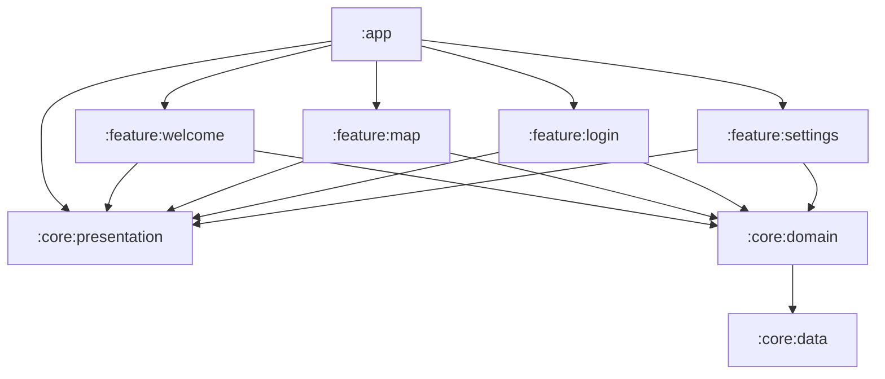

<h1 align="center">Wiki Bidet Map(Work in progress)</h1>

Bidet world map anyone can edit  
- features
    - apply, like, dislike bidet map
    - multi language
    - dark theme
    - login

## Tech stack & Open-source libraries
- Minimum SDK level 24, Target SDK level 33
- Kotlin based, Coroutines + Flow for asynchronous.
- Modularization
- Material3
- Firebase Realtime Database
- Jetpack
    - Compose
    - Lifecycle
    - ViewModel
    - Room
    - Hilt
    - Navigation
- Architecture
    - MVVM Architecture
    - Repository Pattern

## Dependency graph

